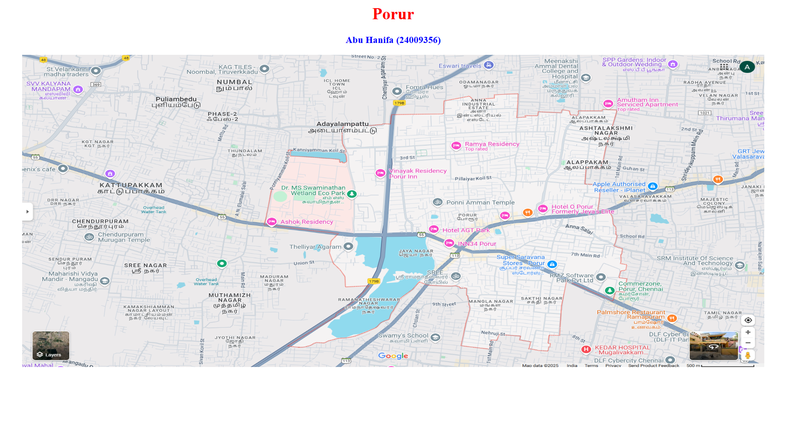
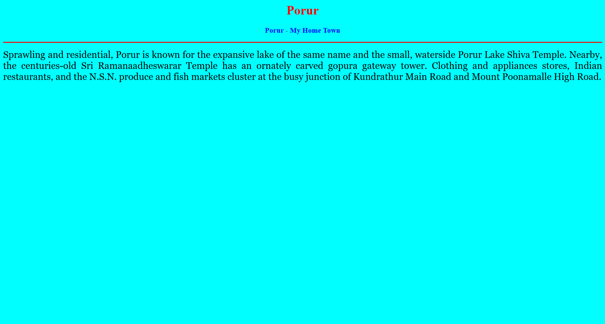
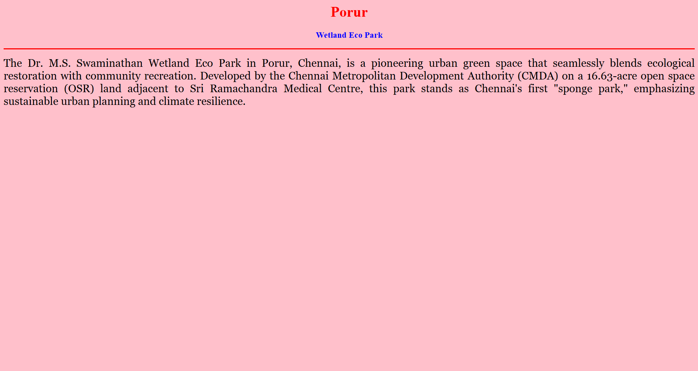
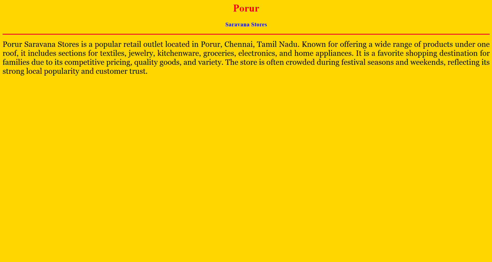
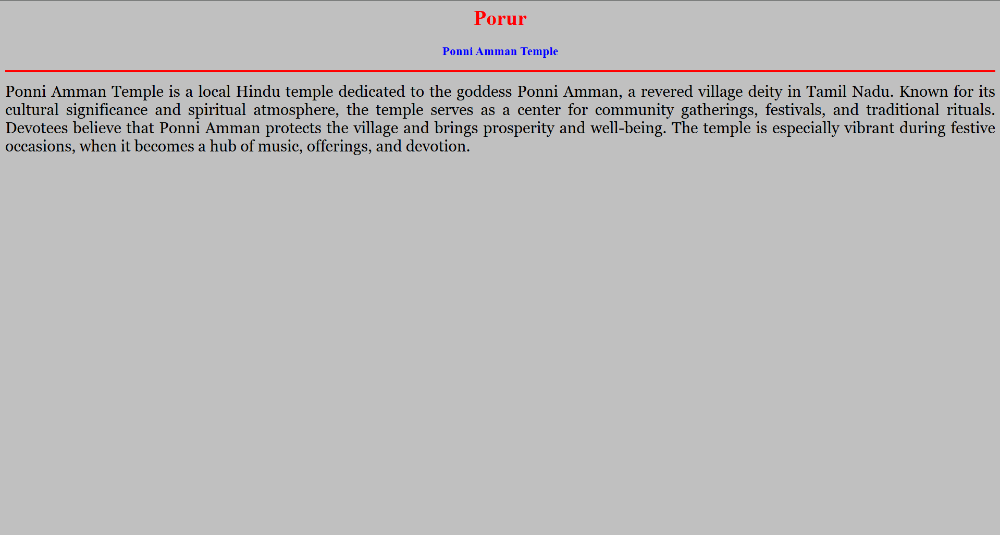
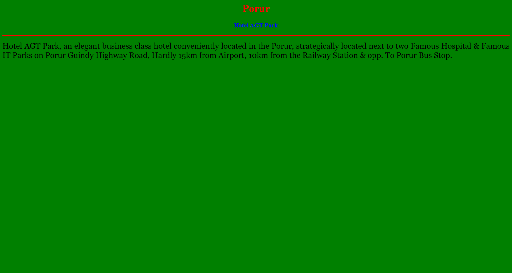

# Ex04 Places Around Me
## Date: 23/04/2025

## AIM
To develop a website to display details about the places around my house.

## DESIGN STEPS

### STEP 1
Create a Django admin interface.

### STEP 2
Download your city map from Google.

### STEP 3
Using ```<map>``` tag name the map.

### STEP 4
Create clickable regions in the image using ```<area>``` tag.

### STEP 5
Write HTML programs for all the regions identified.

### STEP 6
Execute the programs and publish them.

## CODE
```
map.html

<html>
<head>
    <title>My City</title>
</head>
<body>
<h1 align="center">
    <font color="red"><b>Porur</b></font>
</h1>
<h3 align="center">
    <font color="blue"><b>Abu Hanifa (24009356)</b></font>
</h3>
<center>
    
    <map name="MyCity">
        <area shape="rect" coords="700,300,850,400" href="home.html" title="My Home Town">
        <area shape="circle" coords="570,230,45" href="park.html" title="Wetland Eco Park">
        <area shape="circle" coords="640,200,30" href="store.html" title="Saravana Stores">
        <area shape="circle" coords="1120,360,25" href="temple.html" title="Ponni Amman Temple">
        <area shape="rect" coords="950,120,1100,140" href="hotel.html" title="Hotel AGT Park">

    </map>
</center>
</body>
</html>

home.html

<html>
<head>
    <title>My Home Town</title>
</head>
<body bgcolor="cyan">
    <h1 align="center">
        <font color="red"><b>Porur</b></font>
    </h1>
    <h3 align="center">
        <font color="blue"><b>Porur - My Home Town</b></font>
    </h3>
    <hr size="3" color="red">
    <p align="justify">
        <font face="Georgia" size="5">
            Sprawling and residential, Porur is known for the expansive lake of the same name and the small, waterside Porur Lake 
            Shiva Temple. Nearby, the centuries-old Sri Ramanaadheswarar Temple has an ornately carved gopura gateway tower. Clothing 
            and appliances stores, Indian restaurants, and the N.S.N. produce and fish markets cluster at the busy junction of 
            Kundrathur Main Road and Mount Poonamalle High Road.
        </font>
    </p>
</body>
</html>

park.html

<html>
<head>
    <title>My Home Town</title>
</head>
<body bgcolor="pink">
    <h1 align="center">
        <font color="red"><b>Porur</b></font>
    </h1>
    <h3 align="center">
        <font color="blue"><b>Wetland Eco Park</b></font>
    </h3>
    <hr size="3" color="red">
    <p align="justify">
        <font face="Georgia" size="5">
            The Dr. M.S. Swaminathan Wetland Eco Park in Porur, Chennai, is a pioneering urban green space that seamlessly blends 
            ecological restoration with community recreation. Developed by the Chennai Metropolitan Development Authority (CMDA) on a 
            16.63-acre open space reservation (OSR) land adjacent to Sri Ramachandra Medical Centre, this park stands as Chennai's 
            first "sponge park," emphasizing sustainable urban planning and climate resilience. 
        </font>
    </p>
</body>
</html>

store.html

<html>
<head>
    <title>My Home Town</title>
</head>
<body bgcolor="gold">
    <h1 align="center">
        <font color="red"><b>Porur</b></font>
    </h1>
    <h3 align="center">
        <font color="blue"><b>Saravana Stores</b></font>
    </h3>
    <hr size="3" color="red">
    <p align="justify">
        <font face="Georgia" size="5">
            Porur Saravana Stores is a popular retail outlet located in Porur, Chennai, Tamil Nadu. Known for offering a wide range 
            of products under one roof, it includes sections for textiles, jewelry, kitchenware, groceries, electronics, and home 
            appliances. It is a favorite shopping destination for families due to its competitive pricing, quality goods, and variety. 
            The store is often crowded during festival seasons and weekends, reflecting its strong local popularity and customer trust.
        </font>
    </p>
</body>
</html>

temple.html

<html>
<head>
    <title>My Home Town</title>
</head>
<body bgcolor="silver">
    <h1 align="center">
        <font color="red"><b>Porur</b></font>
    </h1>
    <h3 align="center">
        <font color="blue"><b>Ponni Amman Temple</b></font>
    </h3>
    <hr size="3" color="red">
    <p align="justify">
        <font face="Georgia" size="5">
            Ponni Amman Temple is a local Hindu temple dedicated to the goddess Ponni Amman, a revered village deity in Tamil Nadu. 
            Known for its cultural significance and spiritual atmosphere, the temple serves as a center for community gatherings, 
            festivals, and traditional rituals. Devotees believe that Ponni Amman protects the village and brings prosperity and 
            well-being. The temple is especially vibrant during festive occasions, when it becomes a hub of music, offerings, and 
            devotion.


        </font>
    </p>
</body>
</html>


park.html

<html>
<head>
    <title>My Home Town</title>
</head>
<body bgcolor="pink">
    <h1 align="center">
        <font color="red"><b>Porur</b></font>
    </h1>
    <h3 align="center">
        <font color="blue"><b>Wetland Eco Park</b></font>
    </h3>
    <hr size="3" color="red">
    <p align="justify">
        <font face="Georgia" size="5">
            The Dr. M.S. Swaminathan Wetland Eco Park in Porur, Chennai, is a pioneering urban green space that seamlessly blends 
            ecological restoration with community recreation. Developed by the Chennai Metropolitan Development Authority (CMDA) on a 
            16.63-acre open space reservation (OSR) land adjacent to Sri Ramachandra Medical Centre, this park stands as Chennai's 
            first "sponge park," emphasizing sustainable urban planning and climate resilience. 
        </font>
    </p>
</body>
</html>
```

## OUTPUT








## RESULT
The program for implementing image maps using HTML is executed successfully.
